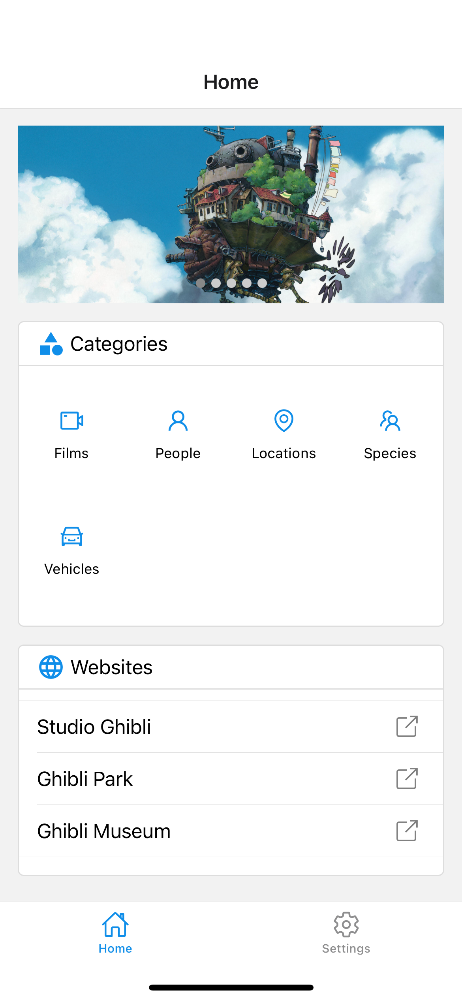
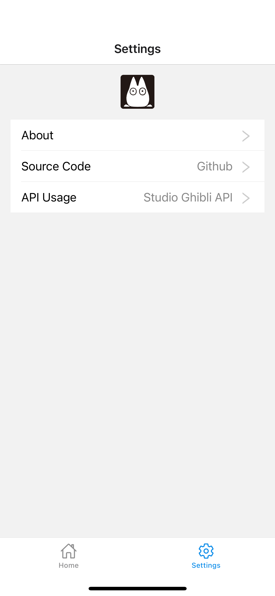
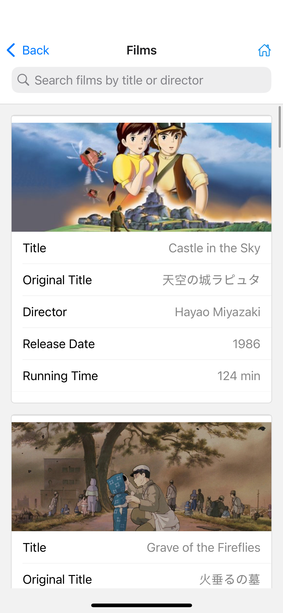
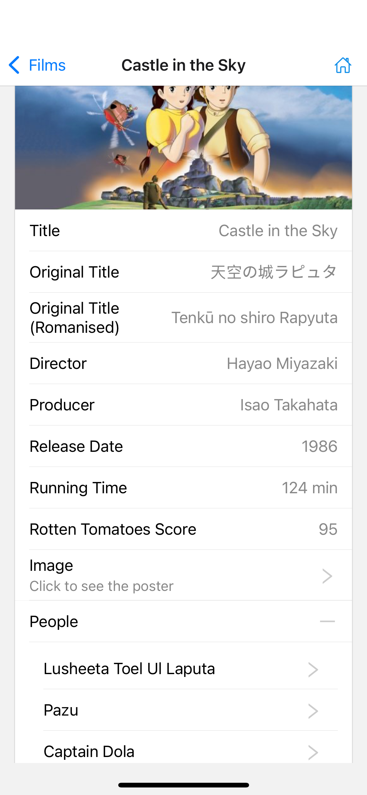
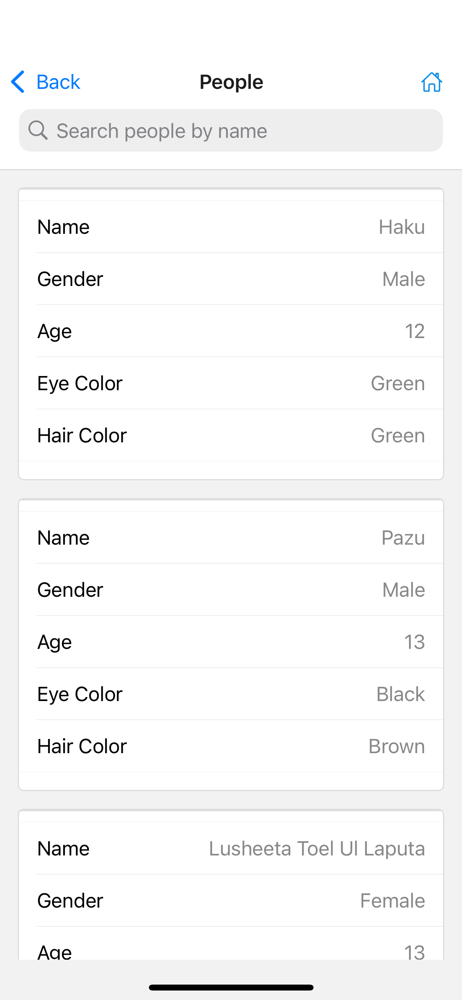
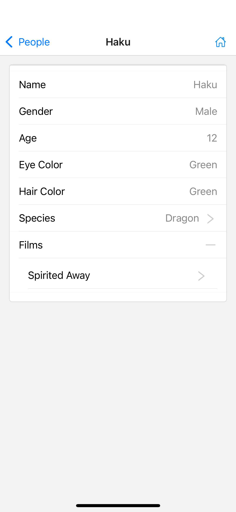

# Ghibli Studio App

A learning-oriented app built with React Native primarily using Expo and TypeScript.

<p>
  
  
  
  
  
  
</p>

## Preview

### With Expo Go

You may install [Expo Go](https://expo.dev/go) to preview the app on your mobile device. Scan the QR code below to open the app in Expo Go.


### With Development Build of Android

Due to creating ios build(dev & prod) requires apple developer account which is not free, only Android development build is provided. You can follow the [steps](https://docs.expo.dev/tutorial/eas/android-development-build/#alternate-use-the-install-button-and-qr) to scan the QR code to install the `.apk` file on your Android device.


## Development

1. Install dependencies

```bash
npm install
```

2. Start the app

```bash
npx expo start # or npm run start
```

## API

The app uses the [Ghibli API](https://ghibliapi.vercel.app/). Note that if you find the API is not working and pages keep loading, you may need to use a proxy to access the API, especially if you are in China.
